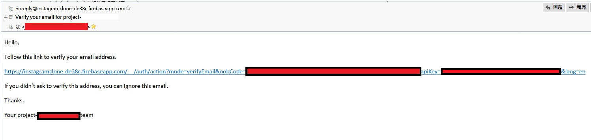
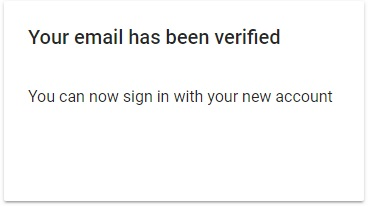
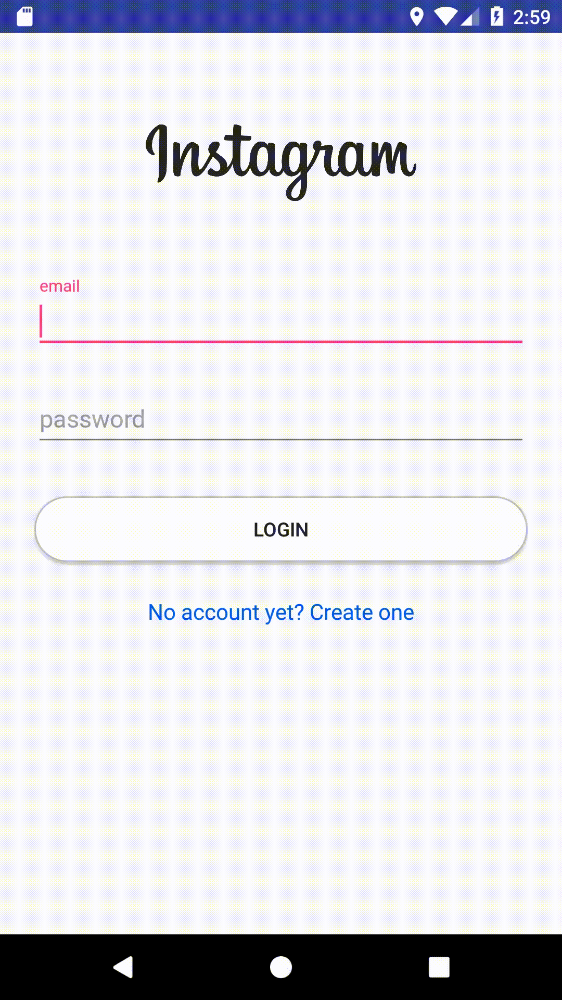

First go to <code>FirebaseMethods</code>, add following comments to <code>addNewUser</code>

<!--more-->

<code>FirebaseMethods</code>

    /**
     * Add information to the  users nodes
     * Add information to the  user_account_settings node
     * @param email
     * @param username
     * @param description
     * @param website
     * @param profile_photo
     */
    public void addNewUser(String email, String username, String description, String website, String profile_photo) {}

Then add a new method called <code>sendVerificationEmail</code> on top of <code>addNewUser</code>

<code>FirebaseMethods</code>

		public void sendVerificationEmail() {
        FirebaseUser user = FirebaseAuth.getInstance().getCurrentUser();

        if(user != null) {
            user.sendEmailVerification()
                    .addOnCompleteListener(new OnCompleteListener<Void>() {
                        @Override
                        public void onComplete(@NonNull Task<Void> task) {
                            if(task.isSuccessful()) {

                            } else {
                                Toast.makeText(mContext, "couldn't send verification email.", Toast.LENGTH_SHORT).show();
                            }
                        }
                    });
        }
    }

We want this method being invoked when new user is registered, so go to <code>registerNewEmail</code>, when the user is succefully register call this method

<code>FirebaseMethods</code>

		public void registerNewEmail(final String email, String password, final String username) {
        mAuth.createUserWithEmailAndPassword(email, password)
                .addOnCompleteListener(new OnCompleteListener<AuthResult>() {
                    @Override
                    public void onComplete(@NonNull Task<AuthResult> task) {
                        if (task.isSuccessful()) {
                            Log.d(TAG, "createUserWithEmail:onComplete:" + task.isSuccessful());

														// call sendVerificationEmail here
                            sendVerificationEmail();
                            // Sign in success, update UI with the signed-in user's information
                            Log.d(TAG, "createUserWithEmail:success");
                            userID = mAuth.getCurrentUser().getUid();
                            Log.d(TAG, "onComplete: AuthState changed: " + userID);
                            //updateUI(user);
                        } else {
                            // If sign in fails, display a message to the user.
                            Log.w(TAG, "createUserWithEmail:failure", task.getException());
                            Toast.makeText(mContext, R.string.auth_failed,
                                    Toast.LENGTH_SHORT).show();
                            //updateUI(null);
                        }

                        // ...
                    }
                });
    }

After the new user registered, the user's state should be log off if he/she doesn't click the verification link from the verification email. But the FIrebase would automatically log the new user in when it's successful registered, so we need to call <code>signout()</code> in <code>RegisterActivity</code> -> <code>AuthListener</code>.

<code>RegisterActivity</code>

		/**
     * Setup firebase auth object
     */
    private void setupFirebaseAuth(){

			Log.d(TAG, "setupFirebaseAuth: setting up firebase auth");

        mAuth = FirebaseAuth.getInstance();
        mFirebaseDatabase = FirebaseDatabase.getInstance();
        myRef = mFirebaseDatabase.getReference();

        mAuthListener = new FirebaseAuth.AuthStateListener() {
            @Override
            public void onAuthStateChanged(@NonNull FirebaseAuth firebaseAuth) {

                FirebaseUser user = firebaseAuth.getCurrentUser();

								if(user != null) {
                    // user is signed in
                    Log.d(TAG, "onAuthStateChanged: sign_in: " + user.getUid());

                    myRef.addListenerForSingleValueEvent(new ValueEventListener() {
                        @Override
                        public void onDataChange(DataSnapshot dataSnapshot) {
													//1st check: Make sure the username is  not already in use
                            if(firebaseMethods.checkIfUsernameExists(username, dataSnapshot)) {
															/**
															 *
															 */
														}

														username = username + append;

                            //add new user to the database
                            firebaseMethods.addNewUser(email, username, "", "", "");

                            Toast.makeText(mContext, "Signup successful. Sending verification email.", Toast.LENGTH_SHORT).show();

                            mAuth.signOut();
                        }

                        @Override
                        public void onCancelled(DatabaseError databaseError) {

                        }
                    });

										finish();

									} else {
                    // User is signed out
                    Log.d(TAG, "setupFirebaseAuth: signed_out");
                }
            }
        };
    }

Next, we call <code>finish()</code> before else statement, it will redirect the page to previous Activity, which is the login page <code>LoginActivity</code> in this case. After we back to the login page, we need to check is the user verified yet, if the user is not verified, it should pop out a message tells the user he/she haven't verify yet. So in <code>LoginActivity</code>, <code>init</code> method, <code>signInWithEmailAndPassword</code> add the function we mentioned

<code>LoginActivity</code>

		private void init(){

        //initialize the button for logging in
        Button btnLogin = (Button) findViewById(R.id.btn_login);
        btnLogin.setOnClickListener(new View.OnClickListener() {
            @Override
            public void onClick(View v) {
                Log.d(TAG, "onClick: attemping to log in.");

                String email = mEmail.getText().toString();
                String password = mPassword.getText().toString();

                if(isStringNull(email) && isStringNull(password)){
                    Toast.makeText(mContext, "You must fill out all the fields", Toast.LENGTH_SHORT).show();
                } else {
                    mProgressBar.setVisibility(View.VISIBLE);
                    mPleaseWait.setVisibility(View.VISIBLE);

                    mAuth.signInWithEmailAndPassword(email, password)
                            .addOnCompleteListener(LoginActivity.this, new OnCompleteListener<AuthResult>() {
                                @Override
                                public void onComplete(@NonNull Task<AuthResult> task) {

                                    // If sign in succeeds, the auth state listener will be notified and logic to handle the
                                    // signed in user can be handled in the listener
                                    if (task.isSuccessful()) {
                                        Log.d(TAG, "signInWithEmail: onComplete: " + task.isSuccessful());
                                        FirebaseUser user = mAuth.getCurrentUser();
																				
																				// new code start here
                                        try{
                                            if(user.isEmailVerified()) {
                                                Log.d(TAG, "onComplete:  success. email is verified.");
                                                Intent intent = new Intent(LoginActivity.this, HomeActivity.class);
                                                startActivity(intent);
                                            } else {
                                                Toast.makeText(mContext, "Email is not verified \n check your email inbox.", Toast.LENGTH_SHORT).show();
                                                mProgressBar.setVisibility(View.GONE);
                                                mPleaseWait.setVisibility(View.GONE);
                                                mAuth.signOut();
                                            }
																				// end here

                                        } catch (NullPointerException e) {
                                            Log.e(TAG, "onComplete: NullPointerException: " + e.getMessage() );
                                        }
                                    } else {
                                        // If sign in fails, display a message to the user.
                                        Log.w(TAG, "signInWithEmail:failure", task.getException());
                                        Toast.makeText(LoginActivity.this, getString(R.string.auth_failed),
                                                Toast.LENGTH_SHORT).show();
                                        //updateUI(null);
                                        mProgressBar.setVisibility(View.GONE);
                                        mPleaseWait.setVisibility(View.GONE);
                                    }

                                    // ...
                                }
                            });
                }
            }
        });
        
The code checks the email is verified or not, if yes it redirect the page to <code>HomeActivity</code>, if not then sot he error message and sign the user out

## Email Screenshot
<figure>

</figure>

## Email Verification Screenshot
<figure>

</figure>

## Program Screenshot

<figure>

</figure>

# Video

