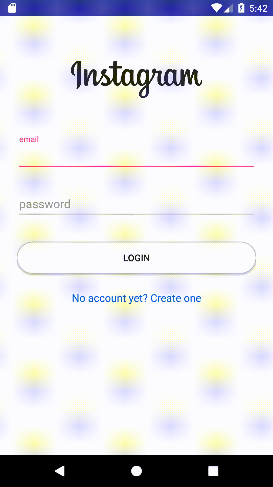

At the beginning, go to <code>RegisterActivity</code>, and delete the following comment in <code>myRef.addListenerForSingleValueEvent(new ValueEventListener()</code> nested in <code>setupFirebaseAuth</code>

    //add new user_account_setting to the database

<!--more-->

The author say the function would in

    //add new user to the database

Then go to <code>FirebaseMethods</code> add a new method
<code>FirebaseMethods</code>

    public void addNewUser(String email, String username, String description, String website, String profile_photo) {}

Go to <code>model/User</code>, change phone_number's type to long
<code>model/User</code>

    private long phone_number;

Update <code>Constructor</code> and <code>Getter and Setter</code>
<code>model/User</code>

    public User(String user_id, long phone_number, String email, String username) {
        this.user_id = user_id;
        this.phone_number = phone_number;
        this.email = email;
        this.username = username;
    }

    public long getPhone_number() {
        return phone_number;
    }

    public void setPhone_number(long phone_number) {
        this.phone_number = phone_number;
    }

Back to <code>FirebaseMethods</code>, add two global variables
<code>FirebaseMethods</code>

    private FirebaseDatabase mFirebaseDatabase;
    private DatabaseReference myRef;

Depending on the tip from Tools->Firebase->Realtime Database->save and retrieve data, the adding variable may change. After adding, then update the adding variables in <code>Constructor</code>: <code>mFirebaseDatabase</code> and <code>myRef</code>

    public FirebaseMethods(Context context) {
        mAuth = FirebaseAuth.getInstance();
        mFirebaseDatabase = FirebaseDatabase.getInstance();
        myRef = mFirebaseDatabase.getReference();
        mContext = context;

        /**
         * rest codes
         */
    }

Then go to <code>res/values/strings</code>
<code>res/values/strings</code>

    <resources>
      <string name="app_name">InstagramClone</string>

      <!-- fragment names -->
      <string name="edit_profile_fragment">Edit Profile</string>
      <string name="sign_out_fragment">Sign Out</string>

      <!-- Firebase messages -->
      <string name="auth_failed">Fail to Authentication</string>
      <string name="auth_success">Authentication Success</string>

      <!-- Firebase database fields -->
      <string name="dbname_users">users</string>
      <string name="dbname_user_account_settings">user_account_settings</string>
    </resources>

Back to <code>addNewUser</code> in <code>FirebaseMethods</code>
<code>FirebaseMethods</code>

    public void addNewUser(String email, String username, String description, String website, String profile_photo) {
        User user = new User(userID, 1, email, StringManipulation.condenseUsername(username) );

        myRef.child(mContext.getString(R.string.dbname_users))
            .child(userID)
            .setValue(user);
    }

Here we finish the addNewUser part, <code>user_account_settings</code> are basically the same. Add a new java class named <code>UserAccountSettings</code> in code>model</code> package. Note here the variables' character should stay the same as the Firebase datastructure, otherwise the app would go wrong, the picture of datastructure is shown below



<code>UserAccountSettings</code>

    public class UserAccountSettings {

      private String description;
      private String display_name;
      private long followers;
      private long following;
      private long posts;
      private String profile_photo;
      private String username;
      private String website;

      public UserAccountSettings(String description, String display_name, long followers, long following,long posts, String profile_photo, String username, String website) {
        this.description = description;
        this.display_name = display_name;
        this.followers = followers;
        this.following = following;
        this.posts = posts;
        this.profile_photo = profile_photo;
        this.username = username;
        this.website = website;
      }

      public UserAccountSettings() {

      }

      public String getDescription() {
        return description;
      }

      public void setDescription(String description) {
        this.description = description;
      }

      public String getDisplay_name() {
        return display_name;
      }

      public void setDisplay_name(String display_name) {
        this.display_name = display_name;
      }

      public long getFollowers() {
        return followers;
      }

      public void setFollowers(long followers) {
        this.followers = followers;
      }

      public long getFollowing() {
        return following;
      }

      public void setFollowing(long following) {
        this.following = following;
      }

      public long getPosts() {
        return posts;
      }

      public void setPosts(long posts) {
        this.posts = posts;
      }

      public String getProfile_photo() {
        return profile_photo;
      }

      public void setProfile_photo(String profile_photo) {
        this.profile_photo = profile_photo;
      }

      public String getUsername() {
        return username;
      }

      public void setUsername(String username) {
        this.username = username;
      }

      public String getWebsite() {
        return website;
      }

      public void setWebsite(String website) {
        this.website = website;
      }

      @Override
      public String toString() {
        return "UserAccountSettings{" +
                    "description='" + description + '\'' +
                    ", display_name='" + display_name + '\'' +
                    ", followers=" + followers +
                    ", following=" + following +
                    ", posts=" + posts +
                    ", profile_photo='" + profile_photo + '\'' +
                    ", username='" + username + '\'' +
                    ", website='" + website + '\'' +
                    '}';
        }
    }

then back to <code>addNewUser</code> method and add <code>UserAccountSettings</code> part
<code>FirebaseMethods</code>

    public void addNewUser(String email, String username, String description, String website, String profile_photo) {
        User user = new User(userID, 1, email, StringManipulation.condenseUsername(username) );

        myRef.child(mContext.getString(R.string.dbname_users))
            .child(userID)
            .setValue(user);

        UserAccountSettings settings = new UserAccountSettings(
                description,
                username,
                0,
                0,
                0,
                profile_photo,
                username,
                website
        );

        myRef.child(mContext.getString(R.string.dbname_user_account_settings))
                .child(userID)
                .setValue(user);
    }

# Testing

After all done, we can test the app and see how it goes. First I got a bug, when I was register new user the logcat shows successful register, but the user's information didn't show in the database. When I tried to register one more time with the email address, the database had the new user data, but the node in database was "user" instead of "users", so I knew I made a typo in <code>res/values/strings</code>, but it was a easy fix. About the set up for the firebase can see in the picture below



Another thing to mention is that we need to choose Realtime Database in Firebase, I chose Cloud FireStore at the first, but the new user's information dones't show in there. I guess there may need some configuration in the app's firebase part, so in here we just stay with Realtime Database.

And for the database would have data when I register twice, I think it's because the addNewUser method in FirebaseMethods wasn't being execute at the first time, the reason might because that I didn't use <code>AuthStateListener</code> at the beginning, and the following testing approved my point, so I wrapped <code>onAuthStateChanged</code> into <code>AuthStateListener</code> then the problem was solved. At the first I wrapped and followed the comment in the video who had the same problem, as shown in the picture



But added <code>finish();</code> would cause the screen redirect to <code>HomeActivity</code> after register successful, so I took that code off.

For the complete code of <code>RegisterActivity</code> and <code>FirebaseMethods</code>, please see the github link below.

[RegisterAcitivity.java](https://github.com/j620656786206/InstagramClone/blob/master/app/src/main/java/tabian/com/instagramclone/Login/RegisterActivity.java)

[FirebaseMethods.java](https://github.com/j620656786206/InstagramClone/blob/master/app/src/main/java/tabian/com/instagramclone/Utils/FirebaseMethods.java) 

# Screenshot

<figure >
 
</figure>

# Video

