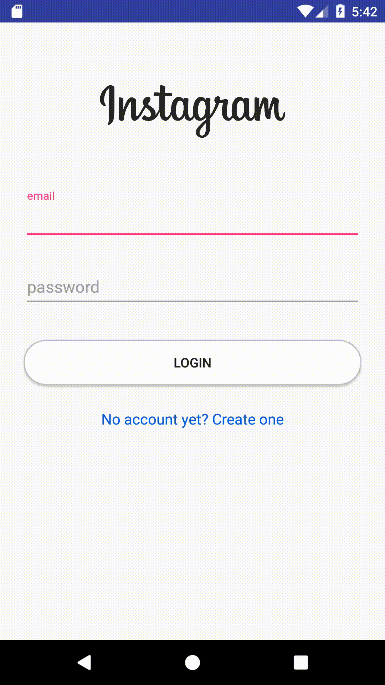

一開始先到<code>RegisterActivity</code>將上次的<code>setupFirebaseAuth</code>做一下修改, 作者將<code>myRef.addListenerForSingleValueEvent(new ValueEventListener()</code>裡的

    //add new user_account_setting to the database

註解刪除, 說這個function會加在

    //add new user to the database

裡面

接著到<code>FirebaseMethods</code>新增一個method
<code>FirebaseMethods</code>

    public void addNewUser(String email, String username, String description, String website, String profile_photo) {}

然後先到<code>model/User</code>, 把phone_number的type改成long

<code>model/User</code>

    private long phone_number;

並更新<code>Constructor</code>還有<code>Getter and Setter</code>
<code>model/User</code>

    public User(String user_id, long phone_number, String email, String username) {
        this.user_id = user_id;
        this.phone_number = phone_number;
        this.email = email;
        this.username = username;
    }

    public long getPhone_number() {
        return phone_number;
    }

    public void setPhone_number(long phone_number) {
        this.phone_number = phone_number;
    }

接著回到<code>FirebaseMethods</code>新增兩個全域變數
<code>FirebaseMethods</code>

    private FirebaseDatabase mFirebaseDatabase;
    private DatabaseReference myRef;

這邊新增的變數可參考Tools->Firebase->Realtime Database->save and retrieve data, 自行斟酌要加哪些變數. 新增後在到<code>Constructor</code>加入<code>mFirebaseDatabase</code>跟<code>myRef</code>的更新

    public FirebaseMethods(Context context) {
        mAuth = FirebaseAuth.getInstance();
        mFirebaseDatabase = FirebaseDatabase.getInstance();
        myRef = mFirebaseDatabase.getReference();
        mContext = context;

        /**
         * rest codes
         */
    }

接著可先到<code>res/values/strings</code>加入
<code>res/values/strings</code>

    <resources>
      <string name="app_name">InstagramClone</string>

      <!-- fragment names -->
      <string name="edit_profile_fragment">Edit Profile</string>
      <string name="sign_out_fragment">Sign Out</string>

      <!-- Firebase messages -->
      <string name="auth_failed">Fail to Authentication</string>
      <string name="auth_success">Authentication Success</string>

      <!-- Firebase database fields -->
      <string name="dbname_users">users</string>
      <string name="dbname_user_account_settings">user_account_settings</string>
    </resources>

然後回到<code>FirebaseMethods</code>的<code>addNewUser</code>
<code>FirebaseMethods</code>

    public void addNewUser(String email, String username, String description, String website, String profile_photo) {
        User user = new User(userID, 1, email, StringManipulation.condenseUsername(username) );

        myRef.child(mContext.getString(R.string.dbname_users))
            .child(userID)
            .setValue(user);
    }

到這邊完成了addNewUser的部分, <code>user_account_settings</code>的部分也是類似的作法. 先到<code>model</code>新增一個java class <code>UserAccountSettings</code>, 這邊要注意的是變數的大小寫要和Firebase當初設置的大小寫一樣, 不然之後會出錯, 關於設置看下圖


<code>UserAccountSettings</code>

    public class UserAccountSettings {

      private String description;
      private String display_name;
      private long followers;
      private long following;
      private long posts;
      private String profile_photo;
      private String username;
      private String website;

      public UserAccountSettings(String description, String display_name, long followers, long following,long posts, String profile_photo, String username, String website) {
        this.description = description;
        this.display_name = display_name;
        this.followers = followers;
        this.following = following;
        this.posts = posts;
        this.profile_photo = profile_photo;
        this.username = username;
        this.website = website;
      }

      public UserAccountSettings() {

      }

      public String getDescription() {
        return description;
      }

      public void setDescription(String description) {
        this.description = description;
      }

      public String getDisplay_name() {
        return display_name;
      }

      public void setDisplay_name(String display_name) {
        this.display_name = display_name;
      }

      public long getFollowers() {
        return followers;
      }

      public void setFollowers(long followers) {
        this.followers = followers;
      }

      public long getFollowing() {
        return following;
      }

      public void setFollowing(long following) {
        this.following = following;
      }

      public long getPosts() {
        return posts;
      }

      public void setPosts(long posts) {
        this.posts = posts;
      }

      public String getProfile_photo() {
        return profile_photo;
      }

      public void setProfile_photo(String profile_photo) {
        this.profile_photo = profile_photo;
      }

      public String getUsername() {
        return username;
      }

      public void setUsername(String username) {
        this.username = username;
      }

      public String getWebsite() {
        return website;
      }

      public void setWebsite(String website) {
        this.website = website;
      }

      @Override
      public String toString() {
        return "UserAccountSettings{" +
                    "description='" + description + '\'' +
                    ", display_name='" + display_name + '\'' +
                    ", followers=" + followers +
                    ", following=" + following +
                    ", posts=" + posts +
                    ", profile_photo='" + profile_photo + '\'' +
                    ", username='" + username + '\'' +
                    ", website='" + website + '\'' +
                    '}';
        }
    }

然後在回到<code>addNewUser</code>加入<code>UserAccountSettings</code>的部分
<code>FirebaseMethods</code>

    public void addNewUser(String email, String username, String description, String website, String profile_photo) {
        User user = new User(userID, 1, email, StringManipulation.condenseUsername(username) );

        myRef.child(mContext.getString(R.string.dbname_users))
            .child(userID)
            .setValue(user);

        UserAccountSettings settings = new UserAccountSettings(
                description,
                username,
                0,
                0,
                0,
                profile_photo,
                username,
                website
        );

        myRef.child(mContext.getString(R.string.dbname_user_account_settings))
                .child(userID)
                .setValue(user);
    }

## 測試階段

接著便可測試程式看哪裡有誤, 一開始我的錯誤是當我註冊新的user時Firebase有成功register user, 但database裡面卻沒有資料, 可是當我在用同樣一組email註冊時database裡就有新的user資料了, 不過在database裡的node是"user"而不是"users", 這點可在<code>res/values/strings</code>做修改. 關於Firebase的相關資料設定可參考下圖

另外要注意的一點是Firebase請選擇用Realtime Database, 我當初一開始是用Cloud Firestore, 但新註冊的user資料沒有顯示在裡面, 可能Firebase的部分需要再另外做設定, 在這邊就不另外去深究.
至於要再按一次register才會有資料的部分我推測是因為第一次FirebaseMethods的addNewUser根本沒有執行到, 原因可能是因為我當初並沒有用<code>AuthStateListener</code>的緣故, 後來測試的結果也如我所料, 所以將<code>onAuthStateChanged</code>以下的code用<code>AuthStateListener</code>包起來便可解決問題. 原本我一開始是包起來後又參照youtube底下跟我有一樣問題的人的作法, 可看下圖



不過因為加入<code>finish();</code>會導致register成功後畫面會再導回<code>HomeActivity</code>, 所以我就又將這行code拿掉了

關於<code>RegisterActivity</code>跟<code>FirebaseMethods</code>的部分可參考Github連結

[RegisterAcitivity.java](https://github.com/j620656786206/InstagramClone/blob/master/app/src/main/java/tabian/com/instagramclone/Login/RegisterActivity.java)

[FirebaseMethods.java](https://github.com/j620656786206/InstagramClone/blob/master/app/src/main/java/tabian/com/instagramclone/Utils/FirebaseMethods.java) 

## 畫面截圖

<figure >
 
</figure>

## 影片

